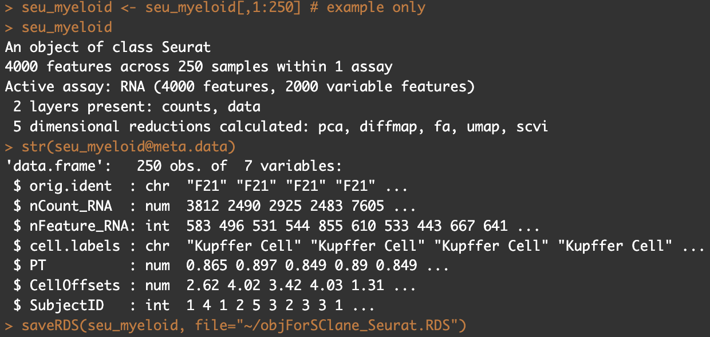
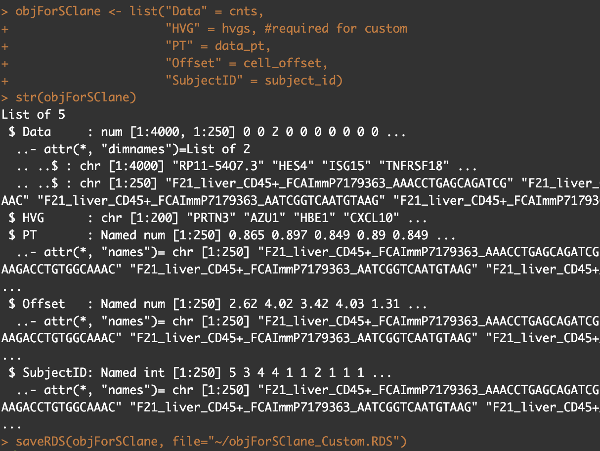

## Usage

scLANE tools is accessible via webserver at: [https://sclane-tools.rc.ufl.edu/](https://sclane-tools.rc.ufl.edu/)


## Examples

<p>You may directly upload a Seurat object as long as the meta data contains all necessary information.</p>
<br>


<br>
<br>
<br>
<p>Alternatively, a custom RDS object can be uploaded with the following format. Note that the Data and HVG are required named items.</p>
<br>



## Installation

You can install `scLANE tools` via GitHub:

``` r
if (!requireNamespace("remotes", quietly=TRUE))
    install.packages("remotes")
    
remotes::install_github("bachergroup/sclanetools")
```